<div align="center">



[](https://github.com/TadeoBC)


> *"No es quién soy por dentro, sino lo que automatizo lo que me define."*


</div>

## 🦇 EXPEDIENTE

```java
public class TadeoBC extends DarkKnight implements Automatizador {

    private final String identidadSecreta = "Dev";
    private final String baseDeOperaciones = "Atlyx Studio";   // la baticueva
    private final String[] arsenal = { "Java ☕", "Web", "Docker", "Postgres", "TypeScript" };

    @Override
    public void patrullar() {
        while (gothamExiste()) {
            if (tareaRepetitiva()) {
                automatizar();            // los criminales (bugs) no descansan, yo tampoco
            }
            construir();
            desplegar();                  // sin miedo, sin backup... bueno, con backup
        }
    }
}
```

## ⚔️ MISIONES

| 🦇 | Misión | Estado |
|---|---|---|
| ⚡ | **Automatizar procesos** de punta a punta: lo manual se vuelve pipeline, cron o bot | `ACTIVA` |
| 🏪 | **Sistemas completos**: POS multigiro SaaS, rastreo GPS en tiempo real, apps de escritorio, e-commerce | `EN PRODUCCIÓN` |
| 🌐 | **Webs** rápidas, animadas y que se ven increíbles | `SIEMPRE` |
| 🚀 | **Servidores propios**: Docker, Caddy, Postgres, TLS, deploys sin depender de nadie | `24/7` |
| 🏢 | **Atlyx Studio**: software a la medida para negocios reales | `FUNDADOR` |


## 🔧 EL BATICINTURÓN

<div align="center">


</div>


## 📡 BAT-COMPUTADORA

<div align="center">


</div>

## 🔒 CLASIFICADO

Casi todo lo que construyo vive en repos **privados**: clientes reales, producción real. Lo que ves aquí es solo lo que Batman te deja ver.


